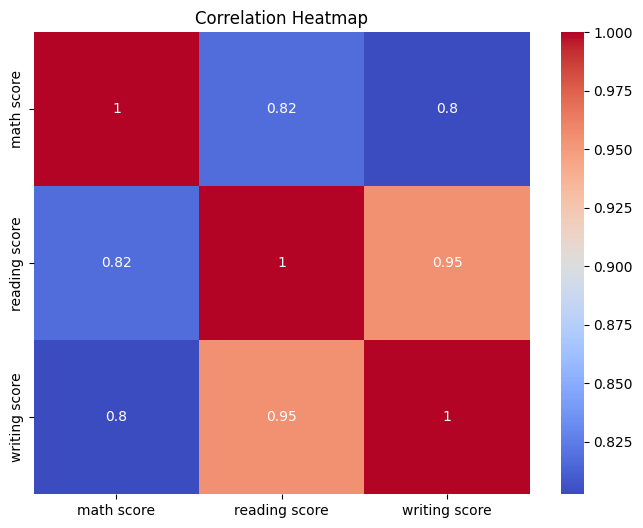
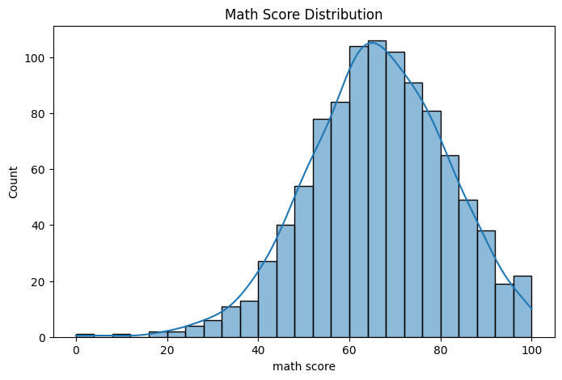
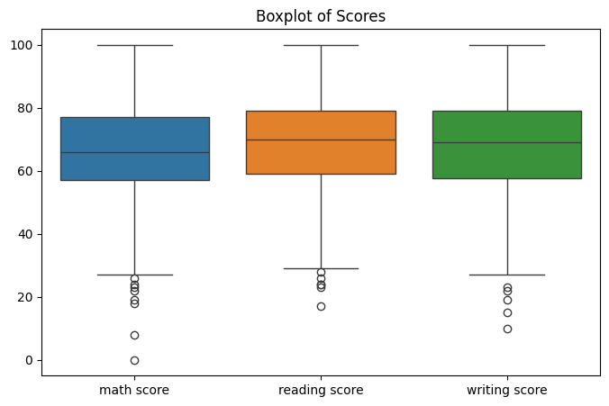

# 🎓 Student Performance Predictor

## 📌 Project Overview

The **Student Performance Predictor** is an end-to-end Machine Learning project that predicts student math performance using academic and demographic features such as reading score, writing score, parental education level, lunch type, and test preparation course.

This project demonstrates the complete ML workflow including:

* Data preprocessing
* Exploratory Data Analysis (EDA)
* Feature engineering
* Model training
* Model evaluation
* Prediction pipeline
* Streamlit deployment
* GitHub version control

---

# 1️⃣ Problem Definition

## Problem Statement

Students often struggle to identify whether they are academically at risk before final examinations.

Educational institutions and teachers require an intelligent system that can:

* Analyze student-related factors
* Predict academic performance
* Identify low-performing students early
* Enable proactive academic support

The goal of this project is to build a Machine Learning model that predicts student math scores using features like:

* Reading Score
* Writing Score
* Gender
* Parental Education
* Lunch Type
* Test Preparation Course
* Race/Ethnicity

---

# 2️⃣ Business Understanding

## Why This Project Matters

This project can help:

* Schools identify academically weak students early
* Teachers provide targeted support
* Parents monitor student progress
* Educational platforms personalize learning strategies

### Real-world Applications

* Student risk analysis
* Academic performance monitoring
* Personalized education systems
* Educational analytics dashboards

---

# 3️⃣ ML Problem Type

## ✅ Regression Problem

Because the target variable:

* **Math Score**

is a continuous numerical value.

The model predicts:

* Exact/Future student scores

### Example

| Input Features             | Predicted Math Score |
| -------------------------- | -------------------- |
| Reading = 70, Writing = 75 | 72.4                 |

---

# 4️⃣ Tech Stack

## 🔹 Core Technologies

* Python
* Pandas
* NumPy
* Scikit-learn
* Matplotlib
* Seaborn
* Joblib

## 🔹 Deployment

* Streamlit

## 🔹 Version Control

* Git
* GitHub

---

# 5️⃣ Recommended Dataset

## 📊 Student Performance Dataset

Source:
Kaggle Student Performance Dataset

The dataset contains:

* Demographic information
* Academic scores
* Education-related attributes

### Main Features

| Feature                     | Description            |
| --------------------------- | ---------------------- |
| gender                      | Student gender         |
| race/ethnicity              | Student group          |
| parental level of education | Parent education level |
| lunch                       | Lunch type             |
| test preparation course     | Preparation status     |
| reading score               | Reading marks          |
| writing score               | Writing marks          |
| math score                  | Target variable        |

---

# 6️⃣ Final Project Architecture

```text
student-performance-predictor/
│
├── screenshots/
│   ├── Correlation Heatmap.png
│   ├── Math Score Distribution.png
│   ├── Boxplot of Scores.png
│   └── app_ui.png
│
├── data/
│   └── raw/
│       └── StudentsPerformance.csv
│
├── notebooks/
│   └── eda.ipynb
│
├── src/
│   ├── data_preprocessing.py
│   ├── train.py
│   ├── predict.py
│   └── utils.py
│
├── app/
│   └── app.py
│
├── models/
│   └── model.pkl
│
├── requirements.txt
├── README.md
└── .gitignore
```

---

# 7️⃣ Exploratory Data Analysis (EDA)

EDA was performed to:

* Understand data distribution
* Identify patterns
* Analyze feature relationships
* Detect outliers
* Study correlations

## 📈 Visualizations Used

### Distribution Plots

* Math score distribution
* Reading score distribution
* Writing score distribution

### Correlation Heatmap

Used to analyze feature relationships.

### Boxplots

Used to identify score spread and outliers.

### Countplots

Used for categorical feature analysis.

---

# 8️⃣ Sample EDA Graphs

## 📊 Correlation Heatmap



---

## 📈 Math Score Distribution



---

## 📉 Boxplot Analysis



---

# 9️⃣ Data Preprocessing

The following preprocessing steps were applied:

* Handling categorical variables
* Label Encoding
* Feature selection
* Train-test splitting

### Train-Test Split

* 80% Training Data
* 20% Testing Data

---

# 🔟 Model Building

## Model Used

### Linear Regression

Linear Regression was used as the baseline model for predicting student scores.

---

# 1️⃣1️⃣ Model Evaluation

The model was evaluated using:

* Mean Absolute Error (MAE)
* Mean Squared Error (MSE)
* R² Score

### Evaluation Metrics

| Metric   | Purpose                  |
| -------- | ------------------------ |
| MAE      | Average prediction error |
| MSE      | Squared prediction error |
| R² Score | Model accuracy           |

---

# 1️⃣2️⃣ Streamlit Web Application

An interactive Streamlit web app was built where users can:

* Enter student details
* Predict math score
* View performance category

### Features

* User-friendly UI
* Real-time prediction
* Performance categorization

---

# 1️⃣3️⃣ Live Deployment

## 🚀 Streamlit Deployment Link

Add your deployed app link here:

```text
https://your-streamlit-app-link.streamlit.app
```

---

# 1️⃣4️⃣ Installation Guide

## Clone Repository

```bash
git clone YOUR_GITHUB_REPOSITORY_LINK
```

## Move Into Project Folder

```bash
cd student-performance-predictor
```

## Create Virtual Environment

### Mac/Linux

```bash
python3 -m venv venv
source venv/bin/activate
```

### Windows

```bash
python -m venv venv
venv\Scripts\activate
```

## Install Dependencies

```bash
pip install -r requirements.txt
```

---

# 1️⃣5️⃣ Run Model Training

```bash
python src/train.py
```

---

# 1️⃣6️⃣ Run Streamlit App

```bash
streamlit run app/app.py
```

---

# 1️⃣7️⃣ Future Improvements

Future enhancements planned:

* Random Forest Regressor
* XGBoost Regressor
* Hyperparameter tuning
* Better UI/UX
* Model comparison dashboard
* Feature importance visualization
* MLflow integration
* Docker deployment
* FastAPI backend
* CI/CD pipeline

---

# 1️⃣8️⃣ Learning Outcomes

This project helped in understanding:

* End-to-end Machine Learning workflow
* EDA and visualization
* Data preprocessing
* Feature engineering
* Regression modeling
* Model evaluation
* Streamlit deployment
* GitHub workflow
* ML project structuring

---

# 1️⃣9️⃣ Screenshots

## 🖥️ Streamlit App UI


---

# 2️⃣0️⃣ Author

## 👩‍💻 Shalini Saurav

BTech CSE (Data Science) Student

Passionate about:

* Artificial Intelligence
* Machine Learning
* Data Science
* Generative AI
* Entrepreneurship

---

# ⭐ If you found this project useful, consider giving it a star on GitHub!
